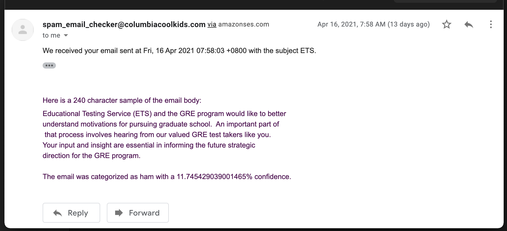

## Portfolio

---

### AWS / Big Data / Cloud Computing 

[Dining Concierge Chatbot](/sample_page)

---
[Voice Controlled Photo Album](/pdf/sample_presentation.pdf)

---
[Spam Detection](http://example.com/)

---

### Coding Projects / School Projects / Other Projects

---

  [Ladybug](http://example.com/)
  

---
- [Project 2 Title](http://example.com/)
- [Project 3 Title](http://example.com/)
- [Project 4 Title](http://example.com/)
- [Project 5 Title](http://example.com/)

---

---

Page template forked from <a href="https://github.com/evanca/quick-portfolio">evanca</a>

<!-- Remove above link if you don't want to attibute -->
