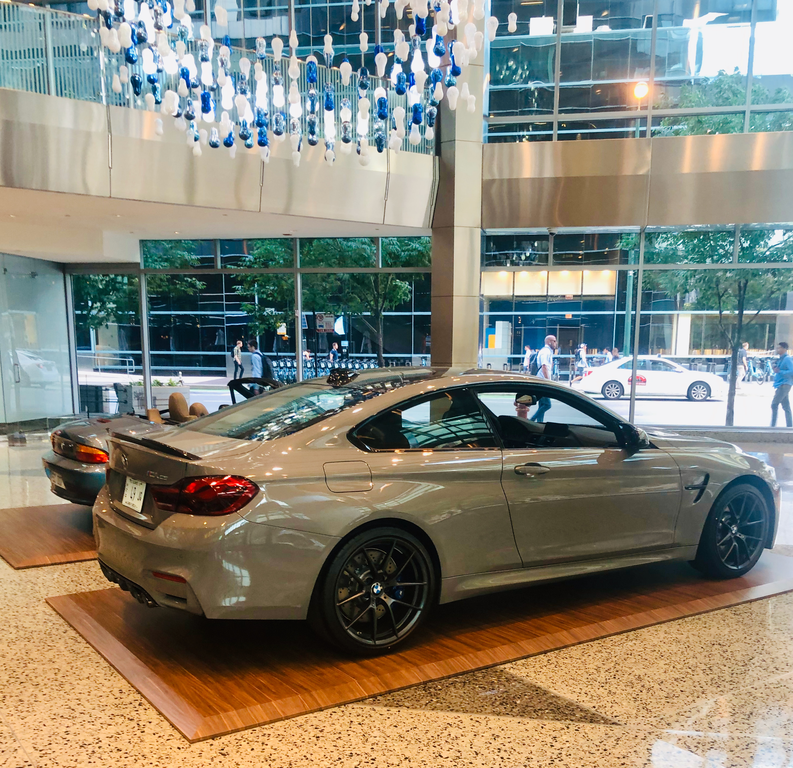

## [Portfolio](https://yizhuowu.github.io/) | [Career](https://yizhuowu.github.io/career) | [Academics](https://yizhuowu.github.io/academics) | [About Me](https://yizhuowu.github.io/about)
---

### BMW Technology Corporation - Chicago, IL

[About BMW Technology Corporation](https://www.bmwgroup.jobs/us-old/en/location/location-chicago.html#ace-1125069962) 
BMW Group • Internship 
June 2019 - Sep 2019 
540 W Madison St Suite 2400, Chicago, IL 60661 
 
Software Engineering Intern at BMW Technology Corporation - Core Services Team 

• Developed new car service features for BMW Connected Drive as micro-services under ASP.NET Core framework with DevOps
development practices. 
• Deployed new services into Microsoft Azure with Azure Webapp, Azure function, Azure CosmosDB, Azure Eventhub, Azure Datalake. 
• Optimized and rewrite several U-SQL queries, enhanced system performance and reduced cost issues. 
• Performed in optimization for machine learning smart pre-conditioning service using python, Apache Hadoop. 
• Accomplished Services Migration to Service Mesh using Kubernetes, dockers, Apache Kafka. 
• Interacted with Machine Learning team, designed and implemented 3+ ML service API endpoints under ASP.NET Core framework. 

• 宝马集团 - 宝马芝加哥研究院 - 核心服务组 - 软件开发实习生 
• 负责宝马云端服务，移动端服务，互联驾驶服务开发。 
• [宝马芝加哥研究院](https://www.bmwgroup.jobs/us-old/en/location/location-chicago.html#ace-1125069962) 

#### Fun facts: At BMW, interns have the opportunity to drive some "Fantastic" vehicles in the BMW garage. Personally speaking,
#### I prefer the i8 and M850i since i8 is BMW's first try at electric cars, while M850's 4.4T V8 engine produces incredible performance. 

 
 