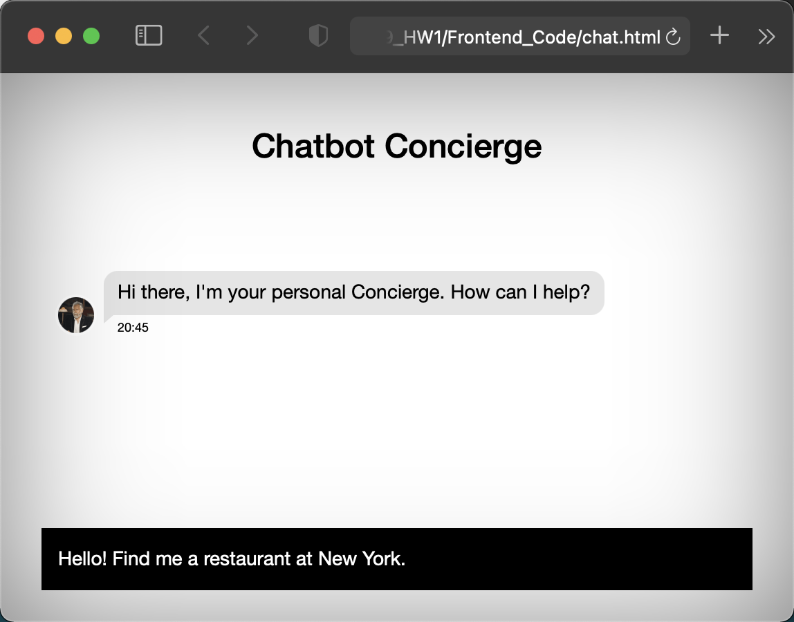

## [Portfolio](https://yizhuowu.github.io/) | [Career](/career) | [Academics](/academics) | [About Me](/about)
---

### Project: AWS / Big Data / Cloud Computing 

### [Dining Concierge Chatbot](https://github.com/YizhuoWu/Dining-Robot)

##### Leveraged AWS services (AWS S3, SQS, SES, Elasticsearch, DynamoDB, API Gateway) to construct a dining concierge chatbot sends user restaurants suggestions given a set of preferences user provide chatbot with.

---
### [Voice Controlled Photo Album](https://github.com/YizhuoWu/6998-Project2-Lambda-search-photos)

##### Applied AWS services to build a photo album. User can leverage voice input to search for photos, webapp's backend will return target photos.

---
### [Spam Detection](https://github.com/YizhuoWu/Spam_Detection)

##### Created a system utilizing Amazon AWS services upon receipt of an email message, it automatically flag it as spam or not, based on prediction obtained from machine learning model.

---

### Coding Projects / School Projects / Other Projects

### [Ladybug](https://github.com/YizhuoWu/Ladybug) 

##### Constructed an Android application to predict women menstrual period, then provide recommendations on lifestyle based on machine learning model.

---

