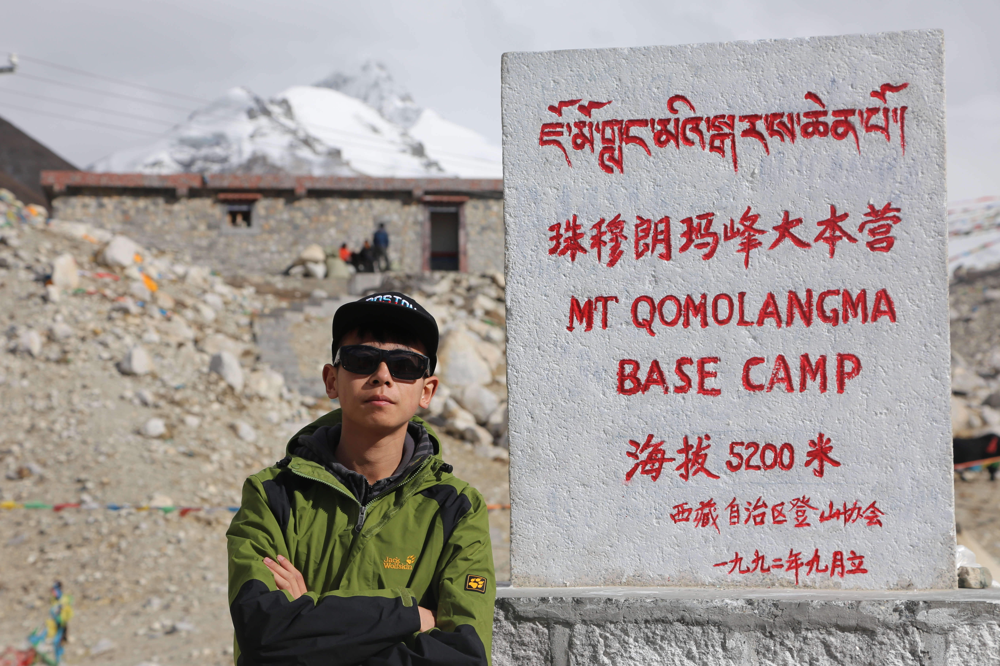
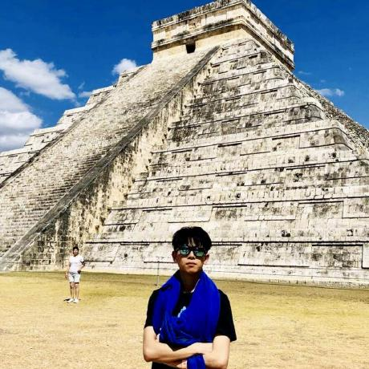

## [Portfolio](https://yizhuowu.github.io/) | [Career](https://yizhuowu.github.io/career) | [Academics](https://yizhuowu.github.io/academics) | [About Me](https://yizhuowu.github.io/about)
---

### About Me

“Whatever it is you're seeking won't come in the form you're expecting.” 
― Haruki Marukami 

I love traveling. I am also fortunate enough to travel to different countries to experience the scenery, culture, and people. Travelling gives me different perspectives on myself, there is no need for me to live in the same way forever. 

### [New Zealand](https://yizhuowu.github.io/travel)

### [Tibet, China](https://yizhuowu.github.io/travel)

### [Japan](https://yizhuowu.github.io/travel)

### [Mexico](https://yizhuowu.github.io/travel)

### More incoming...
---